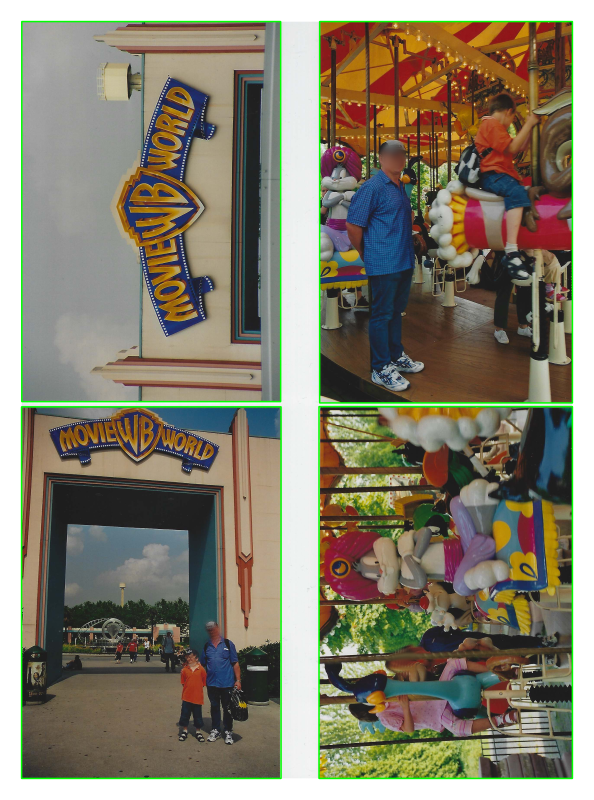

# scanned-photo-splitter

Scan multiple photos at once. Afterwards split the photos with this tool.

## Installation:
```
git clone https://codeberg.org/A-Wels/scanned-photo-splitter/
cd scanned-photo-splitter
python3 -m venv .venv
pip install -r requirements.txt
```

## Usage
```
source .venv/bin/activate
python image_extractor.py <path>
```
Optional:

`-s` Show preview of detected photos


